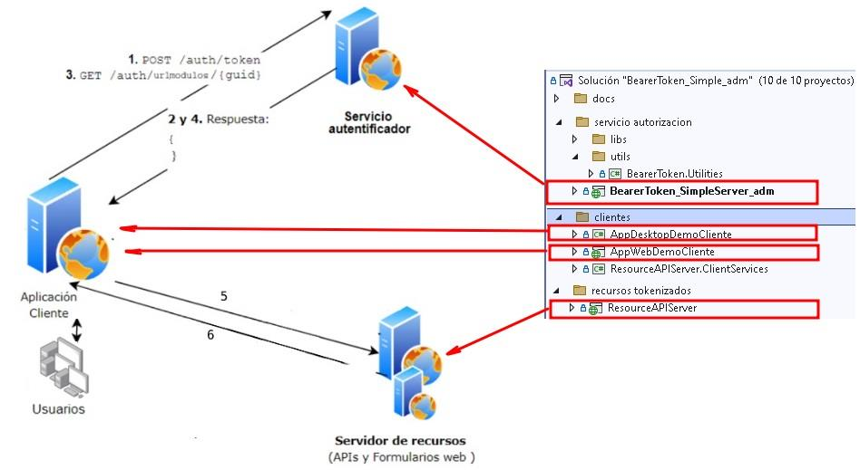

# Distintos escenarios y mecanismos de autenticación  y autorización

        
        
Figura 1. Escenario de prueba del sistema

Los distintos Escenarios implementados de autentificación y autorización son:

* [OAuth2.0 - Bearer Token](# 'OAuth2.0 - Bearer Token (Simple)')
* [OAuth2.0 - Bearer Token (Indentity Server)](# 'OAuth2.0 - Bearer Token (Identity Server)')
* [Bearer token](# 'Bearer token')
* [Bearer token (página de administración)](# 'Bearer token (página de administración)')

## OAuth2.0 - Bearer Token (Simple)

        
Escenario implementando el servicio de autenticación OAuth2.0 por medio de un controlador

       
* [Ver subcarpeta de la solución: OAuth2.0_Simple](OAuth2.0_Simple)

## OAuth2.0 - Bearer Token (Identity Server)

        

        
* [Ver subcarpeta de la solución: OAuth2.0_IdentityServer](OAuth2.0_IdentityServer)

## Bearer token

        

        
* [Ver subcarpeta de la solución: OAuth2.0_Simple](OAuth2.0_Simple)

## Bearer token (página de administración)

        
La solución consta de los proyectos que implementan el esceneraio de autentificación completo, como se muestra en la Figura 2

        
* [Ver subcarpeta de la solución: BearerToken_Simple_adm](BearerToken_Simple_adm)

        
        
Figura 2. Anatomía de la solución 
                  

        
        
Figura 3. ABM de credenciales administración de credenciales 
                  

        
        
Figura 4. Edición de credencial 
                  

